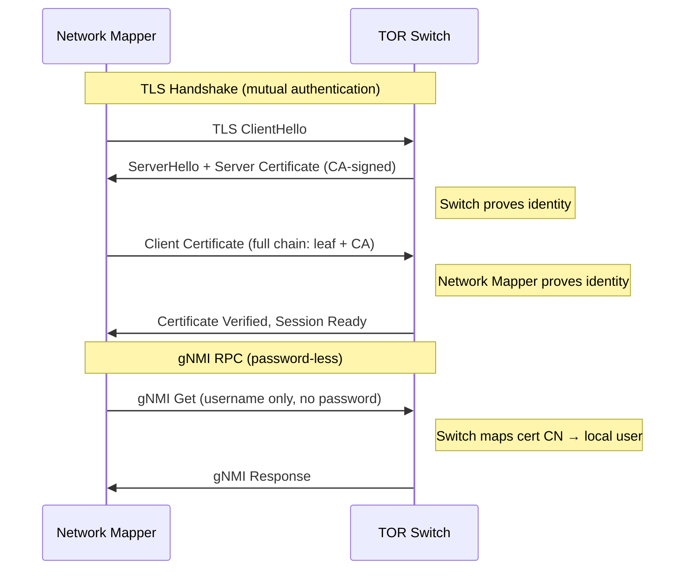

# TLS & mTLS Certificate Setup Guide

How to configure TLS certificate verification and mutual TLS (mTLS) authentication for gNMI connections between Network Mapper and TOR switches.

---

## Table of Contents

- [Overview](#overview)
- [TLS Modes](#tls-modes)
  - [Skip Verify (Development)](#skip-verify-development)
  - [TOFU — Trust-On-First-Use](#tofu--trust-on-first-use)
  - [Explicit CA Certificate](#explicit-ca-certificate)
- [Mutual TLS (mTLS)](#mutual-tls-mtls)
  - [How mTLS Works with gNMI](#how-mtls-works-with-gnmi)
  - [Step 1: Create a Private CA](#step-1-create-a-private-ca)
  - [Step 2: Generate a Client Certificate](#step-2-generate-a-client-certificate)
  - [Step 3: Generate a Server Certificate for the Switch](#step-3-generate-a-server-certificate-for-the-switch)
  - [Step 4: Configure the Switch Certificates](#step-4-configure-the-switch-certificates)
  - [Step 5: Configure Network Mapper](#step-5-configure-network-mapper)
  - [Step 6: Verify the Connection](#step-6-verify-the-connection)
- [Configuration Reference](#configuration-reference)
- [Troubleshooting](#troubleshooting)

---

## Overview

Network Mapper connects to TOR switches over **gRPC with TLS**. There are two separate concerns:

| Concern | What it does | How it works today |
|---|---|---|
| **TLS (transport encryption)** | Encrypts the gRPC connection between Network Mapper and the switch | NX-OS auto-generates a self-signed cert; Network Mapper uses `skip_verify` or TOFU |
| **Authentication (identity)** | Proves who the client is to the switch | Username sent as gRPC metadata; password required without mTLS |

**mTLS** (mutual TLS) adds a second layer: the switch also verifies the client's identity through a TLS client certificate. With mTLS configured, the **password becomes optional** — the switch authenticates the client via its certificate's **Common Name (CN)**, which must match a local user account. The username must still be provided in gRPC metadata.

---

## TLS Modes

Network Mapper supports four TLS verification modes, configured in the `tls:` section of the config file. Choose one based on your environment:

### Skip Verify (Development)

Accepts any certificate from the switch. **Not recommended for production** — vulnerable to man-in-the-middle attacks.

```yaml
tls:
  skip_verify: true
```

Use this for initial testing or lab environments where security is not a concern.

### TOFU — Trust-On-First-Use

On first connection, Network Mapper fetches the switch's certificate, displays its SHA-256 fingerprint, and caches it locally. Subsequent connections verify the switch presents the **same** certificate.

```yaml
tls:
  tofu: true
  cert_dir: .certs    # directory to store cached switch certificates
```

This is a good middle ground — you get TLS verification without needing to manage a CA infrastructure. The operator should verify the fingerprint on first use.

### Explicit CA Certificate

If the switch uses a certificate signed by a known CA (corporate PKI, Let's Encrypt, etc.), point Network Mapper to the CA certificate:

```yaml
tls:
  ca_cert: /path/to/ca-cert.pem
```

This is the most secure server-verification mode. It requires that the switch's gRPC certificate is signed by the CA you specify.

---

## Mutual TLS (mTLS)

> **Reference:** [Cisco NX-OS 10.4x Programmability Guide — gRPC Agent](https://www.cisco.com/c/en/us/td/docs/dcn/nx-os/nexus9000/104x/programmability/cisco-nexus-9000-series-nx-os-programmability-guide-104x/m-grpc-agent.html#configuring-grpc-client-certificate-authentication)
>
> Key takeaways:
> - **Server cert** is imported as a **PKCS12 bundle** via `crypto ca import <tp> pkcs12 bootflash:<file> <password>`
> - **Client cert auth** uses a **separate command**: `grpc client root certificate <trustpoint>` (NOT `grpc certificate`)
> - With client cert auth configured, **password is optional** — the client authenticates via certificate

### How mTLS Works with gNMI

In standard TLS, only the **client** verifies the server's identity. With mTLS, the **server also verifies the client**:



On NX-OS, the client certificate provides **password-less authentication** when
configured with `grpc client root certificate`. The switch validates the client
cert against the imported CA and grants access without requiring a password.

> **Important:** NX-OS still requires the `username` field in gRPC metadata —
> only the `password` is optional. The username must match the CN in the client
> certificate. The client cert PEM file must contain the **full chain** (leaf +
> CA cert) per Cisco documentation: *"Make sure the client needs to supply full
> chain from root CA to its client cert."*

### Step 1: Create a Private CA

You need a Certificate Authority (CA) to sign client certificates. In production, use your organization's PKI. For testing, create a self-signed CA with OpenSSL:

```bash
# Create a directory for certificates (DO NOT commit this to source control)
mkdir certs
cd certs

# Generate a CA private key and self-signed certificate
openssl req -x509 -newkey rsa:2048 \
  -keyout ca-key.pem \
  -out ca-cert.pem \
  -days 365 -nodes \
  -subj "/CN=NetworkMapperCA/O=YourOrganization"
```

This produces:
- `ca-key.pem` — CA private key (**keep this secure**, never share or commit)
- `ca-cert.pem` — CA certificate (this gets imported into the switch)

### Step 2: Generate a Client Certificate

The client certificate identifies Network Mapper to the switch. The **CN must
match a local user account** on the switch (e.g., `gnmiuser`).

```bash
# Generate a client private key and certificate signing request (CSR)
# IMPORTANT: The CN must match a local user on the switch
openssl req -newkey rsa:2048 \
  -keyout client-key.pem \
  -out client-csr.pem \
  -nodes \
  -subj "/CN=gnmiuser/O=YourOrganization"

# Sign the client certificate with your CA
openssl x509 -req \
  -in client-csr.pem \
  -CA ca-cert.pem \
  -CAkey ca-key.pem \
  -CAcreateserial \
  -out client-cert.pem \
  -days 365

# Create the full chain file (required by NX-OS)
# Concatenate client cert + CA cert
cat client-cert.pem ca-cert.pem > client-cert-chain.pem
```

This produces:
- `client-key.pem` — client private key (used by Network Mapper)
- `client-cert.pem` — client certificate (leaf only)
- `client-cert-chain.pem` — **full chain** (leaf + CA, this is what you configure in Network Mapper)
- `client-csr.pem` — signing request (can be discarded after signing)

**Verify the certificate:**

```bash
openssl x509 -in client-cert.pem -noout -subject -issuer -dates
```

Expected output:
```
subject=CN=gnmiuser, O=YourOrganization
issuer=CN=NetworkMapperCA, O=YourOrganization
notBefore=Jun 18 12:00:00 2026 GMT
notAfter=Jun 18 12:00:00 2027 GMT
```

### Step 3: Generate a Server Certificate for the Switch

The switch needs its own certificate signed by the same CA. This replaces the
switch's default self-signed cert (which may expire without warning). The cert
must be bundled as a **PKCS12 file** for import into NX-OS.

```bash
# Generate a server key and cert for each switch
# Replace 192.0.2.1 with your switch's management IP or FQDN
openssl req -newkey rsa:2048 \
  -keyout switch-key.pem \
  -out switch-csr.pem \
  -nodes \
  -subj "/CN=192.0.2.1/O=YourOrganization"

# Create a SAN extension file (REQUIRED — Go TLS ignores CN, only checks SANs)
echo "subjectAltName=IP:192.0.2.1" > switch-ext.cnf

# Sign with your CA (include the SAN extension)
openssl x509 -req \
  -in switch-csr.pem \
  -CA ca-cert.pem \
  -CAkey ca-key.pem \
  -CAcreateserial \
  -out switch-cert.pem \
  -days 365 \
  -extfile switch-ext.cnf

# Bundle into PKCS12 (required for NX-OS import)
openssl pkcs12 -export \
  -out switch-server.pfx \
  -inkey switch-key.pem \
  -in switch-cert.pem \
  -certfile ca-cert.pem \
  -passout pass:CertPass123
```

This produces `switch-server.pfx` — the PKCS12 bundle containing the server
key, server cert, and CA cert chain.

> **Repeat** this step for each switch, using a different CN and SAN (e.g., `192.0.2.2`).

### Step 4: Configure the Switch Certificates

SSH into the switch. You will: (a) import the server identity as PKCS12, (b)
import the CA cert for client verification, and (c) associate both with gRPC.

#### Step 4a: Copy the PKCS12 file to the switch

Copy `switch-server.pfx` to the switch's `bootflash:` using SCP:

```bash
scp switch-server.pfx admin@192.0.2.1:/bootflash/
```

#### Step 4b: Import the server identity (PKCS12)

```
configure terminal

crypto ca trustpoint GRPC-SERVER
crypto ca import GRPC-SERVER pkcs12 bootflash:switch-server.pfx CertPass123
```

> **If you get `duplicate RSA key label` error:** A key with the same label
> exists from a previous import. List keys with `show crypto key mypubkey rsa`,
> then delete the conflicting one: `crypto key zeroize rsa <label>`. Retry the
> import after deleting.

Verify the import:

```
show crypto ca certificates GRPC-SERVER
```

You should see both the server certificate and the CA certificate listed.

#### Step 4c: Import the CA cert for client verification

Create a separate trustpoint for client certificate verification and import
your CA certificate:

```
crypto ca trustpoint GNMI-CLIENT-CA

crypto ca authenticate GNMI-CLIENT-CA
```

Paste the entire contents of `ca-cert.pem`, then type `END OF INPUT` (or
`quit` depending on your NX-OS version) and confirm with `yes`.

#### Step 4d: Associate both with gRPC

```
grpc certificate GRPC-SERVER
grpc client root certificate GNMI-CLIENT-CA

end
```

> **Important:** These are two separate commands with different purposes:
> - `grpc certificate GRPC-SERVER` — sets the **server identity** cert
> - `grpc client root certificate GNMI-CLIENT-CA` — enables **client cert verification** using this CA

**Verify:**

```
show grpc gnmi service statistics
```

Expected output:
```
Cert notBefore : Jun 18 ... 2026 GMT     ← new server cert dates
Cert notAfter  : Jun 18 ... 2027 GMT
Client Root Cert notBefore : Jun 18 ... 2026 GMT   ← CA cert dates (not n/a!)
Client Root Cert notAfter  : Jun 18 ... 2027 GMT
```

If `Client Root Cert` still shows `n/a`, the `grpc client root certificate`
command was not applied.

The gRPC service should show status "Running" with the new certificate.

> **Repeat** Steps 4a–4d for each switch, using each switch's own PKCS12 file.
> The GNMI-CLIENT-CA trustpoint is the same across all switches (same CA).

### Step 5: Configure Network Mapper

Update the Network Mapper config file to use client certificates. There are three approaches:

#### Approach A: mTLS + Skip Verify (Quick test)

Use client cert for authentication but skip verifying the switch's server certificate. Use this if you haven't imported a CA-signed server cert yet.

```yaml
switches:
  - name: TOR-1
    address: "10.0.1.1:50051"
    platform: nxos

auth:
  username: gnmiuser           # REQUIRED — must match the CN in the client cert
  # password is optional with client cert auth

tls:
  skip_verify: true
  client_cert: /path/to/client-cert-chain.pem   # must include full chain (leaf + CA)
  client_key: /path/to/client-key.pem
```

#### Approach B: Full mTLS (Production — recommended)

Verify the switch's server certificate against your CA AND authenticate with client certificates. Both sides of the connection are validated by the same CA. No passwords needed.

```yaml
switches:
  - name: TOR-1
    address: "10.0.1.1:50051"
    platform: nxos

auth:
  username: gnmiuser           # REQUIRED — must match the CN in the client cert

tls:
  ca_cert: /path/to/ca-cert.pem               # YOUR CA — verifies the switch's server cert
  client_cert: /path/to/client-cert-chain.pem  # proves our identity (full chain)
  client_key: /path/to/client-key.pem
```

#### Approach C: TOFU + Client Cert (Middle ground)

Trust the switch's server cert on first connection and pin it. Client cert provides authentication.

```yaml
switches:
  - name: TOR-1
    address: "10.0.1.1:50051"
    platform: nxos

auth:
  username: gnmiuser           # REQUIRED — must match the CN in the client cert

tls:
  tofu: true
  cert_dir: .certs
  client_cert: /path/to/client-cert-chain.pem   # must include full chain (leaf + CA)
  client_key: /path/to/client-key.pem
```

> **Note:** With `grpc client root certificate` configured on the switch, the `password` field is optional per Cisco documentation. However, `username` is **always required** in gRPC metadata and must match the CN in the client certificate. The `client_cert` file must contain the full PEM chain (leaf cert + CA cert concatenated together).

### Step 6: Verify the Connection

Test the connection with a collection run:

```bash
network-mapper collect --config config.yaml --output topology.json
```

Expected output on success:
```
Connected to TOR-1 (192.0.2.1:50051)
  TOR-1: 44 LLDP neighbors
  TOR-1: 69 interfaces
  ...
Topology written to topology.json
```

---

## Configuration Reference

All TLS options live under the `tls:` key in the config file:

| Field | Type | Default | Description |
|---|---|---|---|
| `skip_verify` | bool | `false` | Accept any server certificate (insecure) |
| `tofu` | bool | `false` | Trust-on-first-use — pin the server cert on first connection |
| `cert_dir` | string | `.certs` | Directory to store TOFU-cached certificates |
| `ca_cert` | string | — | Path to CA certificate for server cert verification |
| `client_cert` | string | — | Path to client certificate (for mTLS) |
| `client_key` | string | — | Path to client private key (for mTLS) |

**Precedence order** (first match wins):

1. `ca_cert` — verify against explicit CA
2. `tofu` — trust-on-first-use with pinning
3. `skip_verify` — accept any cert
4. *(none of the above)* — use system CA pool

Client certificate (`client_cert` + `client_key`) can be combined with **any** of the above server verification modes.

---

## Troubleshooting

### TLS handshake failure

```
transport: authentication handshake failed: tls: failed to verify certificate
```

- The switch's server certificate failed verification. Common causes:
  1. **Missing SAN** — Go 1.15+ ignores the CN field and only checks Subject
     Alternative Names. If the server cert was created without a SAN, regenerate
     it with `-extfile` containing `subjectAltName=IP:<switch-ip>` (see Step 3).
  2. **Wrong CA** — the `ca_cert` doesn't match the CA that signed the switch's cert.
  3. **Cert expired** — check dates with `show grpc gnmi service statistics`.
- **Quick fix:** Add `skip_verify: true` alongside the client cert settings (Approach A).
- **Proper fix:** Regenerate the server cert with a SAN, rebuild PKCS12, re-import.

### Certificate rejected by switch

```
rpc error: code = Unavailable desc = connection closed
```

- The switch may be rejecting the client certificate because:
  1. `grpc client root certificate` was not configured — run `show run | include grpc` and verify both `grpc certificate` and `grpc client root certificate` lines are present.
  2. The CA trustpoint for client verification does not contain the correct CA — re-run Step 4c.
  3. The CA cert was pasted incorrectly — re-authenticate the trustpoint.

### Unauthenticated after mTLS

```
rpc error: code = Unauthenticated desc = Authentication failed
```

- **Check 1:** `username` must be present in gRPC metadata (in the `auth:` section
  of the config). NX-OS requires the username even with client cert auth — only
  the password is optional.
- **Check 2:** The `username` must match the `CN` in the client certificate AND
  a local user account on the switch. Verify with `show user-account <username>`.
- **Check 3:** The `client_cert` file must contain the **full chain** (leaf + CA).
  If it only contains the leaf cert, NX-OS rejects it. Concatenate:
  ```bash
  cat client-cert.pem ca-cert.pem > client-cert-chain.pem
  ```
- **Check 4:** `grpc client root certificate` must be configured on the switch.
  Run `show run | include grpc` — you must see **both** lines:
  ```
  grpc certificate GRPC-SERVER
  grpc client root certificate GNMI-CLIENT-CA
  ```
- **Check 5:** The client cert must be signed by the same CA imported into the
  client CA trustpoint. Verify with `show crypto ca certificates <client-ca-trustpoint>`.

### Cannot load client certificate

```
loading client cert: tls: failed to find any PEM data in certificate input
```

- The `client_cert` or `client_key` path is wrong or the files are empty.
- Verify the files exist and contain valid PEM data:
  ```bash
  openssl x509 -in client-cert.pem -noout -text
  openssl rsa -in client-key.pem -noout -check
  ```

### Expired certificates

```
tls: certificate has expired or is not yet valid
```

- Client or CA certificates have expired. Check dates:
  ```bash
  openssl x509 -in client-cert.pem -noout -dates
  openssl x509 -in ca-cert.pem -noout -dates
  ```
- Regenerate and re-sign certificates following Steps 1–3, then re-import into the switch (Step 4).
